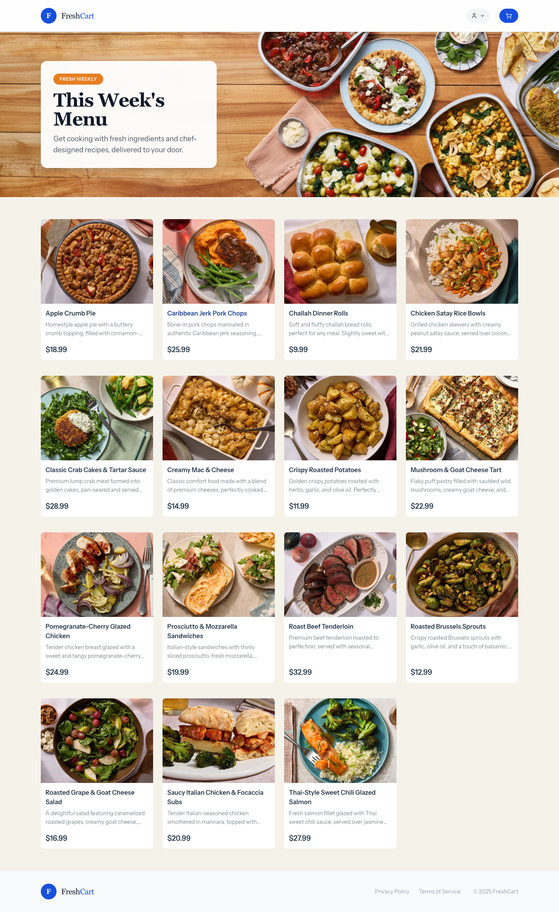

# Shopping Cart

A Laravel-based e-commerce shopping cart test application built with Vue 3, Inertia.js, and Tailwind CSS.

**Demo URL**: https://shopping-cart-main-gkv6pq.laravel.cloud/




## Requirements

- PHP 8.2+
- Node.js 18+
- Composer
- SQLite (default) or MySQL/PostgreSQL

## Installation

### 1. Clone and Install Dependencies

```bash
git clone https://github.com/alikmanukian/shopping-cart.git
cd shopping-cart

# Install all dependencies and set up the application
composer setup
```

The `composer setup` command will:
- Install PHP dependencies
- Copy `.env.example` to `.env`
- Generate application key
- Run database migrations
- Install Node.js dependencies
- Build frontend assets

### 2. Manual Installation (Alternative)

```bash
# Install PHP dependencies
composer install

# Copy environment file
cp .env.example .env

# Generate application key
php artisan key:generate

# Create SQLite database
touch database/database.sqlite

# Run migrations
php artisan migrate

# Seed the database (optional)
php artisan db:seed

# Install Node.js dependencies
npm install

# Build frontend assets
npm run build
```

## Configuration

### Environment Variables

Key environment variables in `.env`:

```env
APP_NAME="Shopping Cart"
APP_URL=http://localhost

# Database (SQLite by default)
DB_CONNECTION=sqlite

# Queue (database driver by default)
QUEUE_CONNECTION=database

# Mail configuration
MAIL_MAILER=smtp
MAIL_HOST=your-smtp-host
MAIL_PORT=587
MAIL_USERNAME=your-username
MAIL_PASSWORD=your-password
MAIL_FROM_ADDRESS="shop@example.com"
MAIL_FROM_NAME="${APP_NAME}"
```

## Queue Setup

The application uses database queues by default for processing background jobs like sending emails.

### Development

The `composer dev` command automatically starts a queue worker alongside the development server:

```bash
composer dev
```

### Production

For production, you should use a process manager like Supervisor to keep the queue worker running.

#### Supervisor Configuration

Create `/etc/supervisor/conf.d/shopping-cart-worker.conf`:

```ini
[program:shopping-cart-worker]
process_name=%(program_name)s_%(process_num)02d
command=php /path/to/shopping-cart/artisan queue:work database --sleep=3 --tries=3 --max-time=3600
autostart=true
autorestart=true
stopasgroup=true
killasgroup=true
user=www-data
numprocs=2
redirect_stderr=true
stdout_logfile=/path/to/shopping-cart/storage/logs/worker.log
stopwaitsecs=3600
```

Then start the supervisor:

```bash
sudo supervisorctl reread
sudo supervisorctl update
sudo supervisorctl start shopping-cart-worker:*
```

## Scheduler (Cron) Setup

The application has scheduled tasks that need to run periodically.

### Scheduled Tasks

| Task | Schedule | Description |
|------|----------|-------------|
| `app:daily-sales-report` | Daily at 00:10 | Sends daily sales report to admin users |

### Production Cron Setup

Add this entry to your server's crontab (`crontab -e`):

```cron
* * * * * cd /path/to/shopping-cart && php artisan schedule:run >> /dev/null 2>&1
```

This runs the Laravel scheduler every minute, which then executes scheduled tasks at their configured times.

### Verify Scheduled Tasks

```bash
# List all scheduled tasks
php artisan schedule:list

# Run the scheduler manually (for testing)
php artisan schedule:run
```

## Development

### Start Development Server

```bash
# Start all services (server, queue, logs, vite)
composer dev
```

This starts:
- Laravel development server (http://localhost:8000)
- Queue worker
- Log viewer (Pail)
- Vite dev server

### Available Commands

```bash
# Send daily sales report manually
php artisan app:daily-sales-report

# Send report for a specific date
php artisan app:daily-sales-report --date=2025-01-15
```

## Testing

```bash
# Run all tests
composer test

# Run unit tests only
composer test:unit

# Run with coverage
composer test:coverage

# Run type coverage
composer test:type-coverage

# Run linting
composer test:lint

# Run static analysis
composer test:types
```

## Code Quality

```bash
# Fix code style (Pint, Rector, ESLint)
composer lint

# Check code style without fixing
composer test:lint
```


## License

MIT
